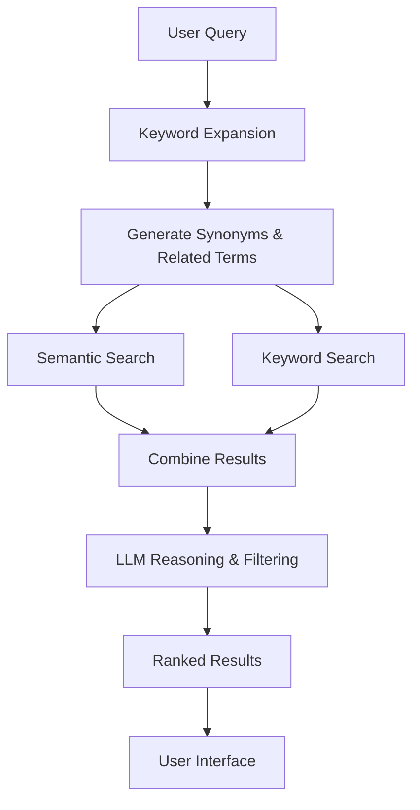

# Advanced RAG Search System

## Overview

This implementation transforms the basic natural language search into a sophisticated RAG (Retrieval-Augmented Generation) search system that combines multiple AI techniques for superior search relevance and accuracy.

## Architecture Components

### 1. Keyword Expansion Engine

- **Purpose**: Expands user queries with synonyms, related terms, and contextual keywords
- **Technology**: Claude 3.5 Haiku LLM
- **Features**:
  - Context-aware expansion based on user profile
  - Industry-specific terminology
  - Role variations and seniority levels
  - Skills and technology associations

### 2. Hybrid Search System

- **Semantic Search**: Vector embeddings using Amazon Titan Text Embeddings v2
- **Keyword Search**: Traditional text matching with expanded terms
- **Weighting**: 60% semantic similarity + 40% keyword relevance
- **Benefits**:
  - Captures both meaning and literal matches
  - Improved recall for specific terms
  - Better handling of technical jargon

### 3. LLM Reasoning Layer

- **Purpose**: Intelligent result filtering and ranking
- **Technology**: Claude 3.5 Haiku
- **Capabilities**:
  - Profile compatibility analysis
  - Professional value assessment
  - Personalized relevance scoring
  - Quality confidence evaluation

## Technical Implementation

### Backend Functions

#### `expandKeywords(query, userContext)`

```typescript
// Expands search terms using LLM
const expansion = await expandKeywords('software engineer', userContext);
// Returns: {
//   expandedTerms: ["software engineer", "developer", "programmer"],
//   synonyms: ["developer", "programmer", "software developer"],
//   relatedTerms: ["full stack", "backend", "frontend", "DevOps"]
// }
```

#### `hybridSearch(query, keywordTerms, limit)`

```typescript
// Combines semantic and keyword search
const results = await hybridSearch(query, expandedTerms, 10);
// Returns results with combined scoring
```

#### `advancedRAGSearch(query, userContext, limit)`

```typescript
// Complete RAG pipeline
const response = await VectorSearchService.advancedRAGSearch(
  'find me a co-founder',
  { userProfile: currentUser },
  10
);
```

### Frontend Components

#### `AdvancedRAGSearch` Component

- Real-time search with debouncing
- Detailed result display with scoring breakdown
- Expandable search insights and reasoning
- Hybrid score visualization

#### Admin Testing Page

- Keyword expansion testing tool
- RAG search demonstration
- Performance metrics display
- Debug information access

## Search Flow



## Key Features

### 1. Contextual Understanding

- Adapts search based on user's role, industry, and experience
- Personalizes results for better professional matches
- Considers career stage and collaboration potential

### 2. Multi-Modal Scoring

- **Semantic Score**: Vector similarity (0-1)
- **Keyword Score**: Term match frequency (0-1)
- **Combined Score**: Weighted combination
- **Reasoning Score**: LLM confidence (0-100)

### 3. Intelligent Filtering

- Minimum quality thresholds
- Relevance-based ranking
- Professional value assessment
- Context-aware suggestions

### 4. Transparency & Debugging

- Expanded keyword visibility
- Score breakdown display
- Search quality indicators
- AI reasoning explanations

## API Endpoints

### Advanced RAG Search

```graphql
query AdvancedRAGSearch {
  vectorSearch(
    action: "advanced_rag_search"
    query: "software engineer"
    userContext: "{\"userProfile\": {...}}"
    limit: 10
  )
}
```

### Keyword Expansion

```graphql
query ExpandKeywords {
  vectorSearch(
    action: "expand_keywords"
    query: "marketing expert"
    userContext: "{\"userProfile\": {...}}"
  )
}
```

## Performance Optimizations

### 1. Search Efficiency

- Debounced queries (500ms)
- Parallel semantic/keyword search
- Optimized DynamoDB scans
- Result caching opportunities

### 2. Cost Management

- Efficient LLM prompts
- Batch operations where possible
- Fallback to simpler search on errors
- Smart retry mechanisms

### 3. Scalability Considerations

- Lambda function optimization
- DynamoDB capacity management
- Bedrock rate limit handling
- Error recovery strategies

## Usage Examples

### Basic Search

```typescript
const results = await VectorSearchService.advancedRAGSearch('find a designer', {
  userProfile: currentUser,
});
```

### With Context

```typescript
const results = await VectorSearchService.advancedRAGSearch(
  'technical co-founder',
  {
    userProfile: {
      jobRole: 'Product Manager',
      industry: 'FinTech',
      yearsOfExperience: 8,
    },
  }
);
```

### Keyword Testing

```typescript
const expansion = await VectorSearchService.expandKeywords('data scientist', {
  userProfile: currentUser,
});
```

## Quality Metrics

### Search Quality Levels

- **Excellent**: High relevance, strong profile match
- **Good**: Relevant results with good compatibility
- **Fair**: Adequate matches, some limitations
- **Poor**: Low relevance, needs query refinement

### Scoring Thresholds

- **Minimum Reasoning Score**: 70/100
- **Semantic Similarity**: ≥0.25
- **Keyword Relevance**: Variable based on term frequency
- **Combined Score**: Weighted average of all factors

## Error Handling

### Graceful Degradation

1. **LLM Failure**: Falls back to basic vector search
2. **Keyword Expansion Error**: Uses original query
3. **Reasoning Failure**: Returns hybrid results
4. **Complete Failure**: Shows user-friendly error message

### Monitoring Points

- LLM response times
- Search quality distribution
- Error rates by component
- User satisfaction metrics

## Future Enhancements

### Phase 2 Features

- **Learning from Interactions**: Improve based on user behavior
- **Collaborative Filtering**: Use connection patterns
- **Advanced Filters**: Industry, location, experience level
- **Saved Searches**: Personal search profiles

### Advanced Capabilities

- **Multi-language Support**: International search
- **Image-based Search**: Profile picture analysis
- **Graph-based Recommendations**: Network effects
- **Real-time Learning**: Adaptive algorithms

## Testing & Validation

### Admin Testing Tools

- Keyword expansion tester
- Search quality analyzer
- Performance benchmarks
- A/B testing framework

### Quality Assurance

- Relevance testing with known queries
- Performance monitoring
- User feedback collection
- Continuous improvement cycles

## Deployment Considerations

### AWS Services Used

- **Lambda**: Vector search processing
- **Bedrock**: Claude LLM + Titan embeddings
- **DynamoDB**: User profile storage
- **AppSync**: GraphQL API

### Configuration

- Model IDs and regions
- Performance parameters
- Error thresholds
- Logging levels

### Security

- IAM permissions for Bedrock access
- User data privacy protection
- Query logging and monitoring
- Rate limiting implementation

## Cost Analysis

### Monthly Estimates (1000 users, 10k searches)

- **Bedrock Claude**: ~$15-25 (reasoning calls)
- **Bedrock Titan**: ~$5-10 (embeddings)
- **Lambda**: ~$2-5 (execution time)
- **DynamoDB**: ~$1-3 (read/write)
- **Total**: ~$23-43/month

### Cost Optimization Strategies

- Efficient prompt engineering
- Result caching
- Smart fallback mechanisms
- Usage-based scaling

---

This advanced RAG search system provides a significant upgrade over basic semantic search, offering personalized, intelligent, and transparent search results that better serve professional networking needs.
